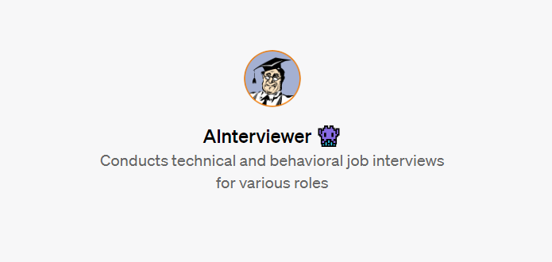

# AInterviewer👾: GPTs-Powered Job Interview Simulator

## Overview

[AInterviewer](https://chat.openai.com/g/g-o2piP6cRT-ainterviewer) conducts tailored job interviews — technical or behavioral — for various roles, competence levels, or specific job positions. 

The aim is to provide a platform for effective interview preparation, especially for those transitioning into new roles or industries. It's designed to offer a customizable interview experience, allowing users to identify their weaknesses and improve their skills. 

AInterviewer is powered by OpenAI's most powerful model, GPT-4, and the latest update, GPTs, which allows fine-tuning of the model for various tasks with custom instructions.

## How to Use It

[AInterviewer](https://chat.openai.com/g/g-o2piP6cRT-ainterviewer) will ask you to provide the following parameters:
* **Specialization:** ML engineer, product designer, etc.
* **Job Position Description (optional):** if you want to train for a specific job position, simply provide its description with text or URL
* **Competence Level:** Junior / Middle / Senior
* **Interview Type:** Technical / Behavioral / Coding
* **Difficulty Level:** choose between Training mode (with tips) and Real mode (more challenging)

After that it will provide a tailored interview based on your needs, so you can practice in a safe, private environment.

AInterviewer also provides feedback based on your answers, helping to identify areas for improvement and enhancing preparation for real-world interviews.

## Language Flexibility

The default language is English, but it can switch to other languages upon request.

## Text & Voice

**Voice interviews** are already **available** in ChatGPT mobile app (both [iOS](https://apps.apple.com/gb/app/chatgpt/id6448311069) and [Android](https://play.google.com/store/apps/details?id=com.openai.chatgpt&hl=en&gl=US))

In the web version of ChatGPT, only text interviews are currently available.

## Limitations

As of 30.11.2023 it requires a premium subscription to access OpenAI's GPTs.

## Sharing

Feel free to share AInterviewer with anyone who might find it useful. Any feedback or suggestions for improvement are always welcome.
